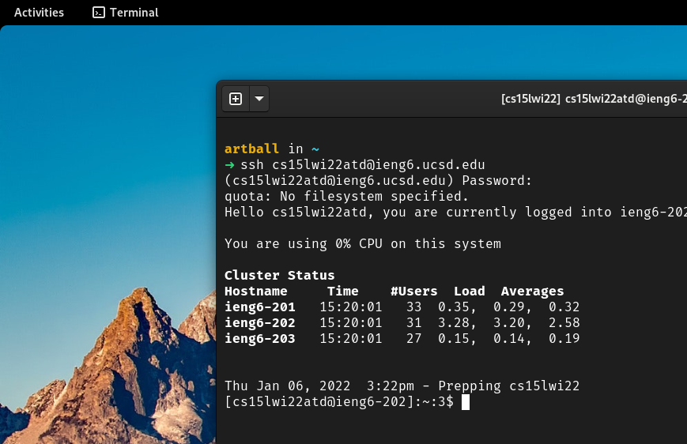

# Lab Report 1 - Remote Access


## Installing VScode
---
I had VSCode already installed, so I didn't need to do anything extra. I will instead write about how I did it.

It is pretty straigtforward to install VSCode on MacOS and Windows. However, the operating system I use for this class is Fedora OS. It is a GNU/Linux distribution, so I had to follow a different set of steps to install VSCode onto my laptop. 

It wasn't too hard. The VSCode website does a good job of explaining how to install it on different GNU/Linux distributions. 

Down below, you can see the website one would need to visit. 


Eventually, you would just need to keep scrolling down until you visit the section corresponding to your operating system. 


You could simply copy the commands and paste them onto your terminal. Both the repository and keys are needed to watch for updates and verify that they come from Microsoft.  

```bash
sudo rpm --import https://packages.microsoft.com/keys/microsoft.asc
sudo sh -c 'echo -e "[code]\nname=Visual Studio Code\nbaseurl=https://packages.microsoft.com/yumrepos/vscode\nenabled=1\ngpgcheck=1\ngpgkey=https://packages.microsoft.com/keys/microsoft.asc" > /etc/yum.repos.d/vscode.repo'
```

Then run
```bash
dnf check-update
sudo dnf install code
```
In the end, you will have VSCode on your computer. It will look like this.


## Remotely Connecting
---

A task we had to complete involved accessing remote server. To do this, we first needed to reset our school account password. Afterwards, we needed to find our designated server directory.

You can do this by going here: https://sdacs.ucsd.edu/~icc/index.php

Afterwards, all you have to do is run the following command with the account number replaced with your own. It will follow the following format.

```bash
ssh cs15lwi22zzz@ieng6.ucsd.edu
```

You will be prompted for a password. Assuming 15 minutes have passed since you last reset your password, type in the new password. The old password wouldn't have worked anyway before the reset. 

Eventually, you will see something like this: 



## Trying Some Commands
---


Once I was logged into the server, I tried out some commands:

```bash
ls           # list files in current directory
ls ~         # list files in home directory (home = ~)
ls /         # list files in root directory (root = /)
cd           # change directory to home directory
cd ..        # change directory to directory above (directory before)
pwd          # print the current directory path 
cat file.txt # print the contents of the file.txt

```

Our tutor recommended we use the `man` command to learn more about these commands. They also talked about `chmod` and how it is used to change the permissions of files.

## Moving Files with scp
---

The `scp` command is useful to send files to remote servers securely. To use it, you would type:

```bash
scp testfile.txt cs15lwi22atd@ieng6.ucsd.edu:~/
```
Here I am sending testfile.txt to the home directory of my account in the remote server. You will be prompted to type in your password to complete the process.

Below is an image of me doing this with a java file.


## Setting an SSH Key
---
Notice how everytime we want to access our remote server, we have to type in our account password. This can take up a lot of our time and be irritating in large projects. 

A nice way to get rid of these password shenanigans is to create a public and private key using the command `ssh-keygen`.

After that, all you would have to do is send the public key to your remote account using the `scp` command. 

Note that during the creation of your public and private keys, don't type anything for the passphrase. Otherwise, you will need to remember the passphrase as your new password.

In the end, you will be able to access your remote account without a password like below. 


This works as long as you have your private key in your computer (in the `.ssh/` directory) and the public key in the remote server (in its own `.ssh/` directory).

## Optimizing Remote Running
---
Creating a file, sending it to the remote server and then opening or running it can take a while.

However, with the help of double quotes and semicolons, we can create a command that exists on one line and call commands automatically in the remote server. 

In my case, I create the following command to edit a java file and then run it on the remote server. 

```bash
nvim WhereAmI.java; scp WhereAmI.java cs15lwi22atd@ieng6.ucsd.edu:~/ ; ssh cs15lwi22atd@ieng6.ucsd.edu "javac WhereAmI.java; java WhereAmI"
```

The semicolons allows for multiple commands to exist on the same line while the double quotes group commands that can then be run together on the remote server after logging into it.

The command automatically allows me to edit the file before sending it. Once changes are saved, the command automatically continues. You can replace “nvim” with “code” to use vscode as a text editor.

This isn't very useful for editing different files but at least now I can simply press the up arrow to return to this command any time I need to update WhereAmI.java.


