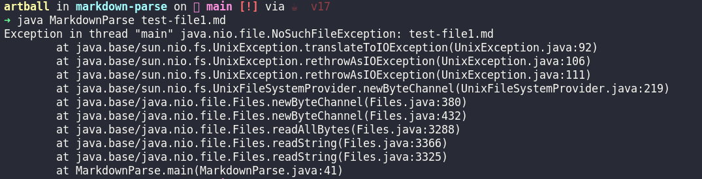
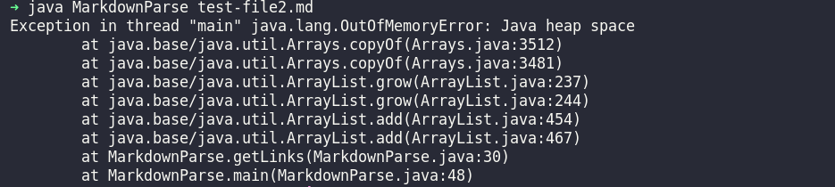
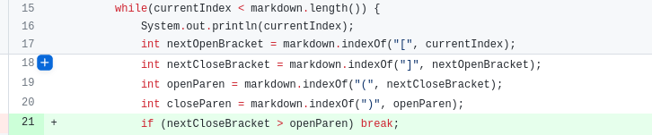
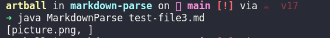
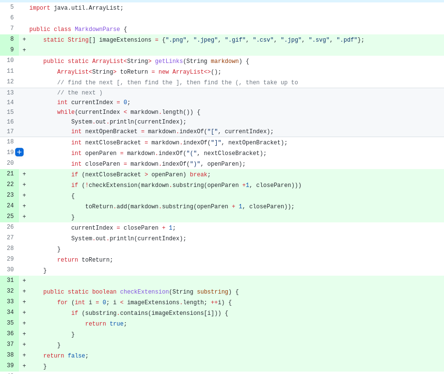
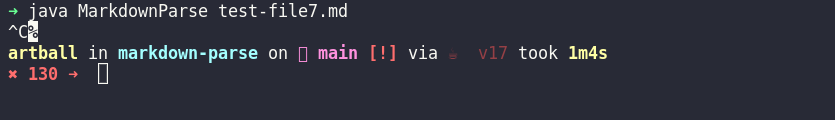
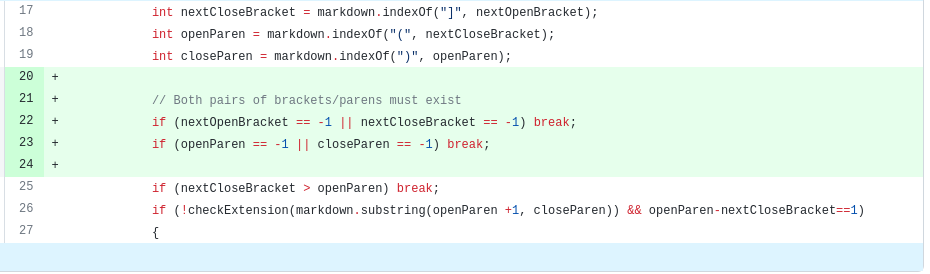

# Lab Report 2 - When Tests Accumulate

## Introduction - What are we doing?
---
The instructions for lab report 2 can be found [here](https://ucsd-cse15l-w22.github.io/week/week4/#week-4-lab-report)
but they can be summarized as the following: 

```
Pick three code changes that your group worked on in labs 3 and 4 in order to fix a bug.

For each of the three code changes:

1. Show a screenshot of the code change diff from Github

2. Link to the test file for a failure-inducing input that prompted you to make that change

3. Show the symptom of that failure-inducing input by showing the output of running the file at the command line for the version where it was failing (this should also be in the commit message history)

4. Write 2-3 sentences describing the relationship between the bug, the symptom, and the failure-inducing input.

```
So with this in mind, let us start by identifying three failure-inducing test files.

- test-file2.md
- test-file3.md
- test-file7.md

## First Code Change: test-file2.md
---
The following snippet below shows the contents of [test-file2.md](misc/test-file2.md):
```markdown  
[!test) (http://www.BadLink.com]
```
As you can see, it is not much. However, when we pass this file into one of the earliest versions of our program:

```java
import java.io.IOException;
import java.nio.file.Files;
import java.nio.file.Path;
import java.util.ArrayList;
public class MarkdownParse {
    public static ArrayList<String> getLinks(String markdown) {
        ArrayList<String> toReturn = new ArrayList<>();
        // find the next [, then find the ], then find the (, then take up to
        // the next )
        int currentIndex = 0;
        while(currentIndex < markdown.length()) {
            System.out.println(currentIndex);
            int nextOpenBracket = markdown.indexOf("[", currentIndex);
            int nextCloseBracket = markdown.indexOf("]", nextOpenBracket);
            int openParen = markdown.indexOf("(", nextCloseBracket);
            int closeParen = markdown.indexOf(")", openParen);
            toReturn.add(markdown.substring(openParen + 1, closeParen));
            currentIndex = closeParen + 1;
            System.out.println(currentIndex);
        }
        return toReturn;
    }
    public static void main(String[] args) throws IOException {
	Path fileName = Path.of(args[0]);
	String contents = Files.readString(fileName);
        ArrayList<String> links = getLinks(contents);
        System.out.println(links);
    }
}
```
We end with our program entering an infinite loop that fills up the ```toReturn``` ArrayList until we run out of heap space!



This is a big no-no. The reason this was happening was because the program didn't take into account the possibility that an opening paranthesis would be paired with a closing bracket (or vice-versa). This is exactly the situation that the test-file2.md file brought to us. The search for the opening and closing parenthesis would have to start after the closing bracket was found. However, the closing bracket was at the very end of the markdown file so searching for the parenthesis would have returned a -1. Adding 1 to -1 results in zero, which in turn was the value the ```currentIndex``` variable was set to in the end of the program. This would be repeated indefinitely until we ran out of heap space because zero would always be less than the number of characters in test-file2.md.

To fix this, we made the following change:



This made sure we broke out of the program if the closing bracket appeared beyond an opening parenthesis. 

## Second Code Change: test-file3.md
---

The contents of [test-file3.md](misc/test-file3.md) are as follows: 
```markdown  
[this is not a link](picture.png)
[another link]()
```
Running the program with this file as input would have it return not just the links between the parenthesis but also the names of the image files.



This is unwanted behavior because we only want to return URLs. (Symptom) 

To fix this problem, we introduced the following changes:



In summary, the program was storing all types of links between an opening and closing parenthesis (the bug). To fix this, we created a method that would help us check the contents of an enclosing substring. If it had any of the extensions we listed in an array beforehand, the substring would not be added into the array list that would eventually be printed.

## Third Code Change: test-file7.md
---
Our final markdown file is [test-file7.md](misc/test-file7.md):

```markdown
)[
```
This markdown file is the smallest one yet! However, when passed as an argument into the program, it would cause it to run forever (Symptom).



This was happening for a similar reason the first markdown file was causing an unwanted behavior. The search for the closing bracket and parenthesis was happening after the position of the opening bracket. This meant they would be never found and reset ```currentIndex``` to zero like the test-file2.md did. (Bug)

To fix this issue, we made the following changes to our code: 



These changes ensure that the programs while loop only runs whenever there are a complete pair of parenthesis or brackets.

This isn't the best solution, but it is compatible with all current test cases. Ideally, we should just skip the substrings that don't satisfy our criteria instead of breaking out completely. 
