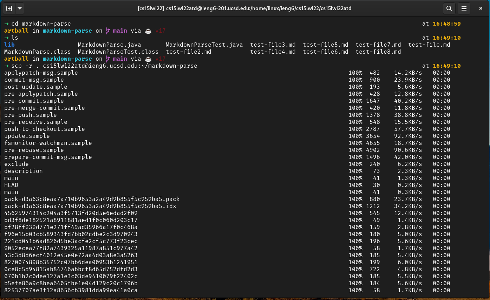
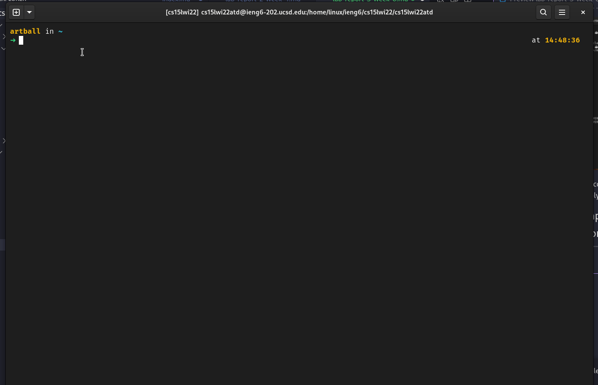
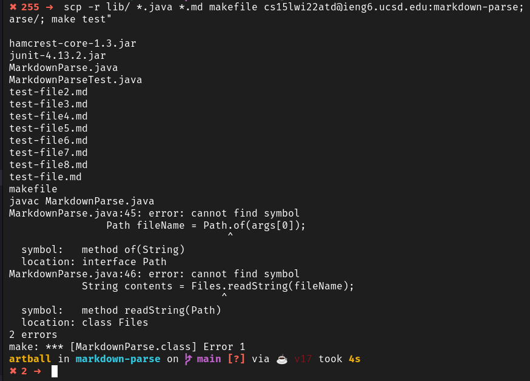

# Lab Report 3 - Copying whole directories with ```scp -r```.
## Introduction - What are we doing?
For this lab, I will practice using ```scp -r``` to copy the ```markdown-parse/``` directory and its contents to the remote ieng6 server. Afterwards, I will copy the directory again and run its tests in only one line using ```ssh```. 

## Step One:  Copy your whole markdown-parse directory to your ieng6 account
---
I open my terminal and start in the home directory. I ```cd``` into ```markdown-parse/``` and copy its contents to 
a new directory of the same name in my ieng6 account. 

Here is the command I used:

```bash
$ scp -r . cs15lwi22atd@ieng6.ucsd.edu:~/markdown-parse
```

```bash
scp -r # Stands for secure copy recursively
.      # Stands for current directory
cs15lwi22atd@ieng6.ucsd.edu # My ieng6 account
~ # The home directory. In this case, it would be the home directory of my ieng6 account
markdown-parse # The new directory we store our copies in
```

Running the command is shown below.



As you can see, all the contents are being copied to
my ieng6 account. The hash codes are probably from the ```.git/``` directory in ```markdown-parse/```. 

## Step Two: Compiling and running tests in the copied repository
---
I log into my ieng6 account using the following command
```bash
$ ssh cs15lwi22atd@ieng6.ucsd.edu
```

After entering the new ```markdown-parse``` directory, I decided to use a ```makefile``` that I created in my most recent lab to compile and run its tests.

```makefile
MarkdownParse.class: MarkdownParse.java
	javac MarkdownParse.java

MarkdownParseTest.class: MarkdownParseTest.java
	javac -cp .:lib/junit-4.13.2.jar:lib/hamcrest-core-1.3.jar MarkdownParseTest.java 
	
test: MarkdownParse.class MarkdownParseTest.class
	java -cp .:lib/junit-4.13.2.jar:lib/hamcrest-core-1.3.jar org.junit.runner.JUnitCore MarkdownParseTest
```
Below, you can see the whole process.



Step Three: Putting it all together.
---
As you saw, the whole process can be lengthly. The number of keystrokes were definitely around 40 - 60, though this is more of an overestimate. 

One way we can shorten the process (copying the directory and then running tests) is to combine the commands like this:

```bash
$ scp -r ~/markdown-parse cs15lwi22atd@ieng6.ucsd.edu:~/markdown-parse; ssh cs15lwi22atd@ieng6.ucsd.edu "cd markdown-parse; make test"
```
However, this kept creating weird problems. I then attempted what was suggested on piazza (copy only the java, markdown, ```lib/``` files) and created this command:

```bash
$ scp -r lib/ *.java *.md makefile cs15lwi22atd@ieng6.ucsd.edu:~/markdown-parse; ssh cs15lwi22atd@ieng6.ucsd.edu "cd markdown-parse; make test"
```

But I recieved the same error.



I eventually realized that ```make test``` did actually work when I entered into my ieng6 account. It just didn't work as part of the command. 

note: I would always remove .class files before copying.


