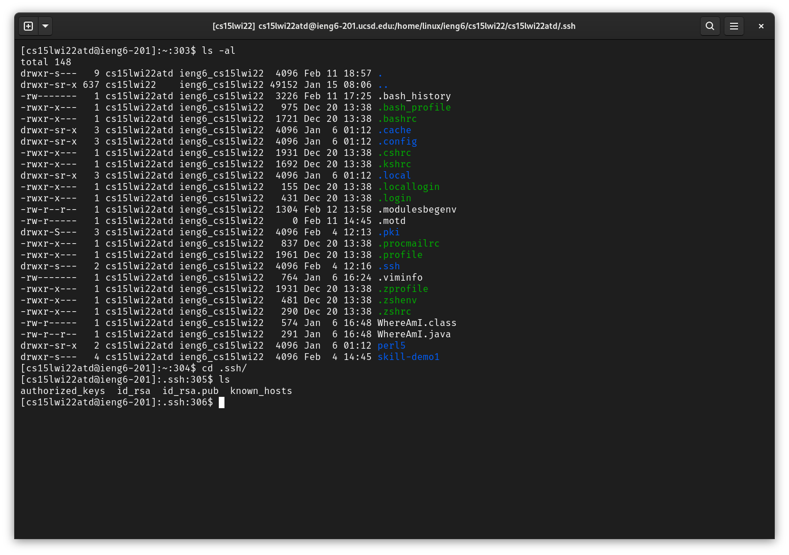
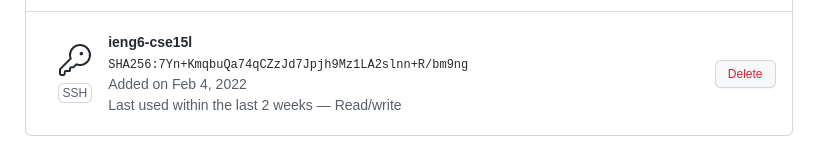
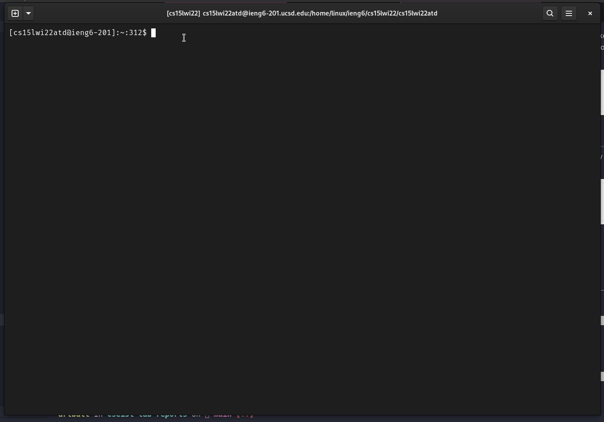
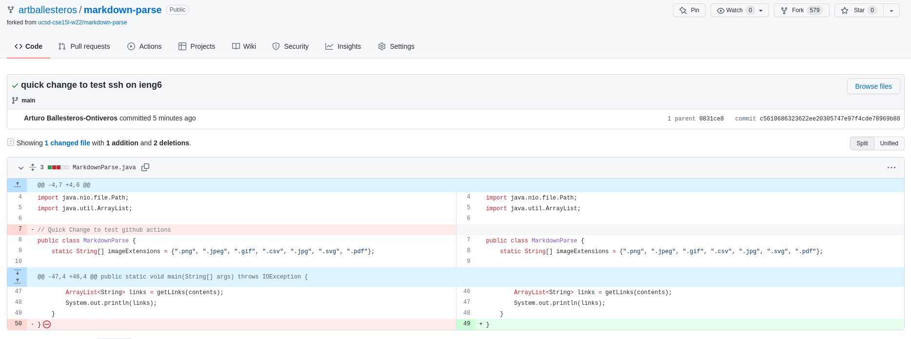

# Lab Report 3 - Setting up Github access with ieng6 
## Introduction - What are we doing?

For this lab, I will create a public-private key pair using
```ssh-keygen``` to easily use git and github on my ieng6 account. 

## Creating the public and private key.
---
For this step, I logged into my ieng6 account and then created a public-private key pair using ```ssh-keygen```.

```bash
$ ssh cs15lwi22atd@ieng6.ucsd.edu
$ # Currently in my ieng6 account
$ ssh-keygen
```
Eventually, I had the public and private keys stored in my
```.ssh/``` directory.



```bash
id_rsa # private key
id_rsa.pub # public key
```

Afterwards, I logged into my github account and clicked ```settings -> SSH and GPG Keys```. While there, I was able to add the contents of ```id_rsa.pub``` to my github account. 



## Does it work?
---

To test the program out, I decided to ```git clone``` my ```markdown-parse``` repository and then make some changes to ```MarkdownParse.java``` to later ```push```.



As you saw, everything worked!

The [commit](https://github.com/artballesteros/markdown-parse/commit/c5610686323622ee20305747e97f4cde78969b88) even shows up on github like it is supposed to. 

