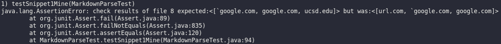
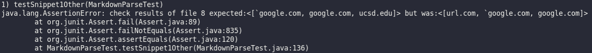
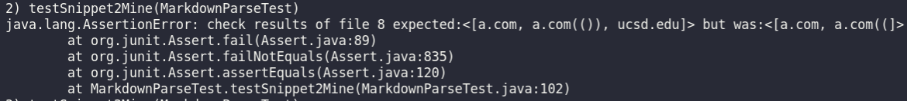
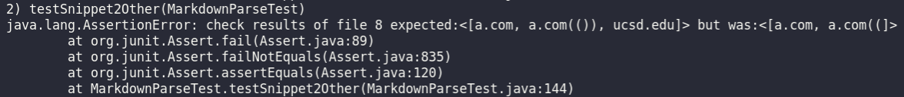
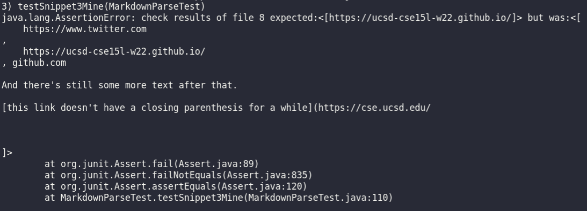

# Week 8 Lab Report
For this lab, we will test [my](https://github.com/artballesteros/markdown-parse) implementation of MarkdownParse using the following snippets and appropriate JUnit tests. 

[Snippet 1](misc/snippet1.md)
```md
`[a link`](url.com)

[another link](`google.com)`

[`cod[e`](google.com)

[`code]`](ucsd.edu)
```

[Snippet 2](misc/snippet2.md)
```md
[a [nested link](a.com)](b.com)

[a nested parenthesized url](a.com(()))

[some escaped \[ brackets \]](example.com)

```

[Snippet 3](misc/snippet3.md)
```md
[this title text is really long and takes up more than 
one line

and has some line breaks](
    https://www.twitter.com
)

[this title text is really long and takes up more than 
one line](
    https://ucsd-cse15l-w22.github.io/
)


[this link doesn't have a closing parenthesis](github.com

And there's still some more text after that.

[this link doesn't have a closing parenthesis for a while](https://cse.ucsd.edu/


)

And then there's more text
```

We will do the same for [another group's](https://github.com/LippsVega/markdown-parse) implementation.

For each snippet, we will explain whether or not we could add a small change in the code to pass the tests. (less than 10 lines of code).

## Snippet One
---
For this snippet, I created the following tests:

```java
@Test
public void testSnippet1() throws IOException {
    Path fileName = Path.of("snippet1.md");
    String contents = Files.readString(fileName);
    List<String> links = List.of("`google.com", "google.com", "ucsd.edu");
    assertEquals("check results of file 8", links, MarkdownParse.getLinks(contents));
}
```
The test did not pass for both my implementation and the other groups implementation:

My implementation:


Other implementation:


I believe we can change the code slightly to fix this issue. The reason the test case doesn't pass is because I have
two conditionals that break out of the while loop if pairs of brackets don't exist in the subsection of string we are
looking at. Consequently, the last ```ucsd.edu``` isn't pushed in the list of links we want. 

I would have to modify the conditional statements to take into account the possibility that a bracket is within two ticks. The bracket within the ticks would have to be ignored.

## Snippet Two
---
For this snippet, I created the following tests:

```java
@Test
public void testSnippet2() throws IOException {
    Path fileName = Path.of("snippet2.md");
    String contents = Files.readString(fileName);
    List<String> links = List.of("a.com", "a.com(())", "ucsd.edu");
    assertEquals("check results of file 8", links, MarkdownParse.getLinks(contents));
}
```
The test did not pass for both my implementation and the other groups implementation:

My implementation:


Other implementation:


I feel like passing this JUnit test would involve a change that would be less than 10 lines long. I suspect that the reason this test failed is for the same reason snippet one failed.

The line below is the reason the test failed:

```md
[a nested parenthesized url](a.com(()))
```
Specifically, it was this part:

```md
(a.com(()))
```

The code reached the leftmost open parenthesis and found a pair with the first closed parenthesis from the left. 

Consequently, the string that was grabbed was this one:
```md
a.com((
```

This left us with the following:
```md
)))
```
Which doesn't have open parenthesis partners, causing a break out of the while loop and an early exit from the program. 

To fix this, I would have to find a way to consider just the first open parenthesis and the last closed parenthesis on the same line. This would ignore the unpaired parenthesis within.  

## Snippet Three
---
For this snippet, I created the following tests:

```java
@Test
public void testSnippet3() throws IOException {
    Path fileName = Path.of("snippet3.md");
    String contents = Files.readString(fileName);
    List<String> links = List.of("https://ucsd-cse15l-w22.github.io/");
    assertEquals("check results of file 8", links, MarkdownParse.getLinks(contents));
}
```
The test did not pass for both my implementation and the other groups implementation:

My implementation:


Other implementation:


I suspect this may need a more involved change. When multiple newlines exist between parenthesis, the link doesn't work. Consequently, it shouldn't be added to the final list. However, when the link exist on only a single line, the link does work. Furthermore, this doesn't take into account how newlines within brackets should be treated. This will probably require a change more than 10 lines long. 