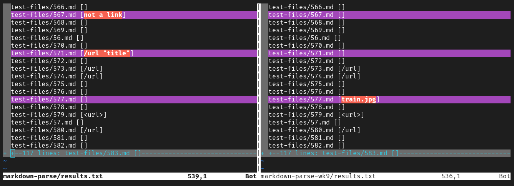

# Week 10 Lab Report

So for this lab, I had to run both ```markdown-parse``` and 
```markdown-parse-wk9``` with ```test-files``` as an argument. I then recorded their results to compare the outputs of different test cases. Running the program over all test cases was done using a [bash script](misc/script.sh).  

```bash
# script.sh

for file in test-files/*.md;
do
	echo -n "$file "
	java MarkdownParse $file
done
```
```bash
# from home directory 
cd markdown-parse/
make
bash script.sh > results.txt
```

```bash
# from home directory 
cd markdown-parse-wk9/
make
bash script.sh > results.txt
```

After doing this, I compared the two ```results.txt``` files using vim.

```bash
# from home directory 

vimdiff markdown-parse/results.txt markdown-parse-wk9/results.txt
```

## Choosing two tests to compare
---

### Test One

I decided to compare the output of passing [577.md](misc/577.md) into both implementations of ```MarkdownParse```.

```markdown

```
Using ```vimdiff```, we found the following differences in output:


We expect ```MarkdownParse``` to NOT record a link to an image. Knowing this, we can tell that our implementation of ```MarkdownParse``` is following correct behavior. The other implementation of ```MarkdownParse``` is not because it records ```train.jpg``` as a link. 

To fix this, we should first identify where in [MarkdownParse.java](misc/MarkdownParse.java) we should implement any change.
I believe that because we are parsing the wrong links from the file, we should look at the section of code where the file parsing is actually done. 

```java
51      public static ArrayList<String> getLinks(String markdown) {
  1         ArrayList<String> toReturn = new ArrayList<>();
  2         // find the next [, then find the ], then find the (, then take up to
  3         // the next )
  4         int currentIndex = 0;
  5         while(currentIndex < markdown.length()) {
  6             int nextOpenBracket = markdown.indexOf("[", currentIndex);
  7             int nextCodeBlock = markdown.indexOf("\n```");
  8             if(nextCodeBlock < nextOpenBracket && nextCodeBlock != -1) {
  9                 int endOfCodeBlock = markdown.indexOf("\n```");
 10                 currentIndex = endOfCodeBlock + 1;
 11                 continue;
 12             }
 13             int nextCloseBracket = markdown.indexOf("]", nextOpenBracket);
 14             int openParen = markdown.indexOf("(", nextCloseBracket);
 15  
 16             // The close paren we need may not be the next one in the file
 17             int closeParen = findCloseParen(markdown, openParen);
 18             
 19             if(nextOpenBracket == -1 || nextCloseBracket == -1
 20                   || closeParen == -1 || openParen == -1) {
 21                 return toReturn;
 22             }
 23             String potentialLink = markdown.substring(openParen + 1, closeParen).trim();
 24             if(potentialLink.indexOf(" ") == -1 && potentialLink.indexOf("\n") == -1) {
 25                 toReturn.add(potentialLink);
 26                 currentIndex = closeParen + 1;
 27             }
 28             else {
 29                 currentIndex = currentIndex + 1;
 30             }
 31         }
 32         return toReturn;
```

Looking at this code, we can note that there is nothing that stops us from capturing a link with an image extension like ```.png``` or ```.jpg```. One thing we can do, is check for these image extensions and ignore those links instead of adding them to the ```toReturn``` array. That is what I did for my implementation of ```MarkdownParse```. However, this is an imperfect solution. There are countless image extensions as well as new ones that appear every so often. 

A better solution would be to exploit the fact that everytime we want to link an image, we add an 
exclamation mark in front of the two square braces like so:

```md

```

We could add something that checks for this exclamation mark and skips ahead to the next link when detected. We would set ```currentIndex``` to the last closed parenthesis of the image link and then use the ```continue``` statement to skip to the next link that we find. 

We would add this checker after line 12 because we would want to ensure that we would skip an entire code block instead of just a part of it. If we placed the checker before line 12, there is a possibility that we will detect the exclamation mark inside the code block and then skip to the next closed bracket, which will likely also be inside the code block. For the code block detection to work properly, it looks like we would need both triple ticks (```) on both sides of the code blocks, which we possibly lose in the scenario above.  

So checking for image links after checking for code blocks seems like a better option. 


### Test Two

For the second test, I decided to compare the output of passing [567.md](misc/567.md) into both implementations of ```MarkdownParse```.

```markdown
[foo](not a link)

[foo]: /url1
```
Using ```vimdiff```, we found the following differences in output:



This time, we do have valid links. However, we expect ```MarkdownParse``` to record ```/url1``` as a link. 
Neither of the implementations do this, so we can say that both implementations are incorrect.

We would need to fix both implemenations to correct this. However, I will focus on my own implementation of ```MarkdownParse.java``` for now.

To fix this, we should first identify where in [MarkdownParse.java](misc/MarkdownParse2.java) we should implement any change.
My file is actually really small compared to the other implementation of ```MarkdownParse.java``` so this was pretty easy. 
The ```getLinks()``` method is where the actual string parsing is done, so I believe this is where we should implement 
any bug fixes. 

```java
10      public static ArrayList<String> getLinks(String markdown) {
  1         ArrayList<String> toReturn = new ArrayList<>();
  2         // find the next [, then find the ], then find the (, then take up to
  3         // the next )
  4         int currentIndex = 0;
  5         while(currentIndex < markdown.length()) {
  6             int nextOpenBracket = markdown.indexOf("[", currentIndex);
  7             int nextCloseBracket = markdown.indexOf("]", nextOpenBracket);
  8             int openParen = markdown.indexOf("(", nextCloseBracket);
  9             int closeParen = markdown.indexOf(")", openParen);
 10             
 11             // Both pairs of brackets/parens must exist
 12             if (nextOpenBracket == -1 || nextCloseBracket == -1) break;
 13             if (openParen == -1 || closeParen == -1) break;
 14  
 15             if (nextCloseBracket > openParen) break;
 16             if (!checkExtension(markdown.substring(openParen +1, closeParen)) && openParen-nextCloseBracket==1)
 17             {
 18                 toReturn.add(markdown.substring(openParen + 1, closeParen));
 19             }
 20             currentIndex = closeParen + 1;
 21         }
 22         return toReturn;
 23     }
```

Before going further into the bug fixes, I think it helps identifying the things that are going wrong with my implementation.
I identified two things:

1. ```MarkdownParse``` records ```not a link``` as a link. 
2. ```MardkownParse``` does not record ```/url1``` as a link.

I think both of these issues are pretty difficult to resolve. For the first issue, we need to find a way of differentiating
links and non-links. I know that URLs follow a specific format so I could probably check for that format in the string.
I could also try to ping the link and see if its successful but that would depend on having reliable internet. I also think it can inadvertently DDoS an actual link if the link is found repeatedly in the document. Even if that is something that doesn't happen, I can't help but feel that a simpler solution exists. 

Assuming we create a URL differentiator, I would place it between lines 17 and 18. This would check the link before adding it to the ```toReturn``` array. If the string isn't a valid link, then I would not add anything and continue with the rest of the loop.

For the second issue, my first thought would be to check for strings with the following format

```markdown
[foo]: url
```
Anytime we find a colon, we could look for the first non-space character and parse the string until the last non-space character. Checking for the colon can happen after checking whether the positions of the open and closed brackets are in order (line 12). If they are not, we break like normal. If they are, we can then check if there is a colon after the closed bracket but before the open or closed parenthesis. If it is, we then parse the string like we wanted to and add it to the link. Otherwise, we continue like normal. This string parser would probably happen after line 12 as well but before the if statement on line 13.

This change would probably pass this test. However, I notice that it wouldn't be correct to parse the link in the following text 

```markdown
[]: /url1
```

We should also not record ```/url1``` if the following were to happen

```markdown
[foo](wwww.not-a-link.com) 

[foo]: /url1
```

I notice using the Vscode preview feature on said markdown text would ignore the ```/url1``` link. Consequently, I believe that ```MarkdownParse``` should not record ```/url1``` as a valid link. 

Fixing this would involve more changes, but the test already passes so I won't worry about it.