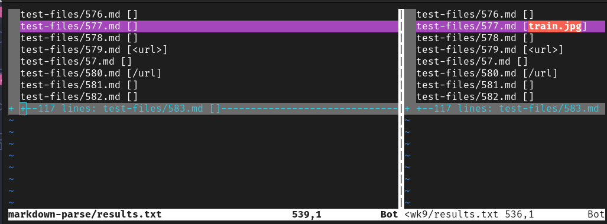

# Week 10 Lab Report

So for this lab, I had to run both ```markdown-parse``` and 
```markdown-parse-wk9``` with ```test-files``` as an argument. I then recorded their results to compare the outputs of different test cases. Running the program over all test cases was done using a [bash script](misc/script.sh).  

```bash
# script.sh

for file in test-files/*.md;
do
	echo -n "$file "
	java MarkdownParse $file
done
```
```bash
# from home directory 
cd markdown-parse/
make
bash script.sh > results.txt
```

```bash
# from home directory 
cd markdown-parse-wk9/
make
bash script.sh > results.txt
```

After doing this, I compared the two ```results.txt``` files using vim.

```bash
# from home directory 

vimdiff markdown-parse/results.txt markdown-parse-wk9/results.txt
```

## Choosing two tests to compare
---

I decided to compare the output of passing [577.md](misc/577.md) into both implementations of ```MarkdownParse```.

```markdown

```
Using ```vimdiff```, we found the following differences in output:



We expect ```MarkdownParse``` to NOT record a link to an image. Knowing this, we can tell that our implementation of ```MarkdownParse``` is following correct behavior. The other implementation of ```MarkdownParse``` is not because it records ```train.jpg``` as a link. 

To fix this, we should first identify where in [MarkdownParse.java](misc/MarkdownParse.java) we should implement any change.
I believe that because we are parsing the wrong links from the file, we should look at the section of code where the file parsing is actually done. 

```java
51      public static ArrayList<String> getLinks(String markdown) {
  1         ArrayList<String> toReturn = new ArrayList<>();
  2         // find the next [, then find the ], then find the (, then take up to
  3         // the next )
  4         int currentIndex = 0;
  5         while(currentIndex < markdown.length()) {
  6             int nextOpenBracket = markdown.indexOf("[", currentIndex);
  7             int nextCodeBlock = markdown.indexOf("\n```");
  8             if(nextCodeBlock < nextOpenBracket && nextCodeBlock != -1) {
  9                 int endOfCodeBlock = markdown.indexOf("\n```");
 10                 currentIndex = endOfCodeBlock + 1;
 11                 continue;
 12             }
 13             int nextCloseBracket = markdown.indexOf("]", nextOpenBracket);
 14             int openParen = markdown.indexOf("(", nextCloseBracket);
 15  
 16             // The close paren we need may not be the next one in the file
 17             int closeParen = findCloseParen(markdown, openParen);
 18             
 19             if(nextOpenBracket == -1 || nextCloseBracket == -1
 20                   || closeParen == -1 || openParen == -1) {
 21                 return toReturn;
 22             }
 23             String potentialLink = markdown.substring(openParen + 1, closeParen).trim();
 24             if(potentialLink.indexOf(" ") == -1 && potentialLink.indexOf("\n") == -1) {
 25                 toReturn.add(potentialLink);
 26                 currentIndex = closeParen + 1;
 27             }
 28             else {
 29                 currentIndex = currentIndex + 1;
 30             }
 31         }
 32         return toReturn;
```

Looking at this code, we can note that there is nothing that stops us from capturing a link with an image extension like ```.png``` or ```.jpg```. One thing we can do, is check for these image extensions and ignore those links instead of adding them to the ```toReturn``` array. That is what I did for my implementation of ```MarkdownParse```. However, this is an imperfect solution. There are countless image extensions as well as new ones that appear every so often. 

A better solution would be to exploit the fact that everytime we want to link an image, we add an 
exclamation mark in front of the two square braces like so:

```md

```

We could add something that checks for this exclamation mark and skips ahead to the next link when detected. We would set ```currentIndex``` to the last closed parenthesis of the image link and then use the ```continue``` statement to skip to the next link that we find. 